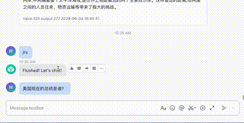

## intro
this is a fork of

https://github.com/aws-samples/aws-serverless-openai-chatbot-demo/tree/bedrock

# LarkBot-Bedrock Claude3
Build a bot in Lark (飞书) using Bedrock Claude3 model. The backend is hosted on AWS's serverless
For steps in Lark side, please refer to [develop-a-bot-in-5-minute](https://open.feishu.cn/document/home/develop-a-bot-in-5-minutes/create-an-app)

## Feature

Streaming the output



## Architecture


## Steps   
1. create a `.env` file in folder `cdkstack/`,  add the your actual variables. 
```  
# 项目相关设置
DB_TABLE=lark_messages
START_CMD=/rs

# 飞书相关设置
LARK_APPID={LARK_APPID}
LARK_APP_SECRET={LARK_APP_SECRET}
LARK_TOKEN={LARK_TOKEN}
LARK_ENCRYPT_KEY={LARK_ENCRYPT_KEY}

# AWS 相关设置
AWS_AK={AWS_AK}
AWS_SK={AWS_SK}
AWS_REGION_CODE={AWS_REGION_CODE}
AWS_BEDROCK_CLAUDE_SONNET=anthropic.claude-3-sonnet-20240229-v1:0
AWS_CLAUDE_MAX_SEQ=10
## claude 系统提示词
AWS_CLAUDE_SYSTEM_PROMPT=所有的回答用中文
## 多模态图片提示词
AWS_CLAUDE_IMG_DESC_PROMPT=描述下图片内容
## 每个用户最大对话数量
AWS_CLAUDE_MAX_CHAT_QUOTA_PER_USER=1000
```   
2. Install the AWS CDK  
`npm install -g aws-cdk`  

3. In folder `cdkstack/`  
run `cdk bootstrap`  
run `cdk synth`   
run `cdk deploy`  

4. Once deply success, you can get the api endpoint from the output.  
For example,

Use this URL as the callback url for lark message event.  

1. After all dones. congrats  


##  Features:

* cdk部署整套架构
* 飞书+claude3支持文字和图片交流
* 内置命令 /rs 清空历史对话
* 内置命令 /tc token统计
* 内置命令 /sp 系统提示词
* 控制了单个chat_id最大对话数，防止api abuse
* 历史对话有效期默认24小时
